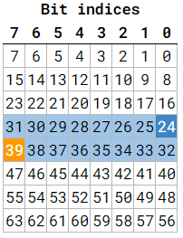

# DBC File Parsing Demo

The following is a demo of how to install and use the [dbcppp](https://github.com/xR3b0rn/dbcppp/tree/master) library in a project to parse .dbc files.

## DBC File Format

A DBC (Datebase CAN) file is used to define the message and signal definitions for communication on a CAN (Controller Area Network) bus. The general format goes as follows:

 - **Version Information**: This section specifies the version of the DBC file format being used. It often appears at the beginning of the file and helps ensure compatibility with different DBC file readers.

 - **Node Definitions** (`BU_:`) This section defines the network nodes (ECUs) that are part of the CAN network. Each node is given a unique name and an associated network address (Node ID).

 - **Message Definitions** (`BO_:`) This section defines the messages or frames that can be transmitted over the CAN bus. Each message has a unique message identifier (CAN ID) and can contain one or more signals.

 - **Signal Definitions** (`SG_:`) Signals represent the individual data elements within a message. This section defines each signal's name, bit position, length, scaling, and other attributes. Signals are used to encode and decode data within messages.

 - **Value Tables** (`VAL_TABLE_:`) Value tables are used to assign descriptive labels to specific signal values. For example, you might use a value table to map numeric values in a signal to meaningful text labels.

 - **Attribute Definitions**: DBC files can include various attributes that provide additional information about nodes, messages, or signals. These attributes are often used to document and annotate the communication parameters.

 - **Comments** (`CM_`): Comments are not mandatory but are often included to provide human-readable explanations, notes, or documentation for various parts of the DBC file.


See the `example.dbc` file for a very basic example.

Consult the following resources for more information:
 - https://www.csselectronics.com/pages/can-dbc-file-database-intro 
 - https://cantools.readthedocs.io/en/latest/

## Installation and Setup

These steps are assuming you are running a Linux system.

1. Run `git clone --recurse-modules [repo-link-here]` to clone this repo
2. Enter the `dbcppp` submodule, and run the install steps. Ensure that your `/usr/local/lib` directory now contains a file called `libdbcppp.so`.
3. From the root of this repo, run the following:

```
cd build
cmake ..
make
cp ../example.dbc .
```

You should now see an executable called `dbc_parse_demo` in the `build/` folder.

## Using the dbcppp CLI

The dbcppp library comes with a CLI to print the contents of dbc files in a human readable format. Using the CLI on the `example.dbc` file in this repo returns the following:

```
dbcppp dbc2 --dbc=example.dbc --format=human
================================= Messages =================================
  Name:       MyMessage
  ID:         0x1F4
  Length:     0x8
  Sender:     Front_CANNode
  Layout:
                          Bit
             7   6   5   4   3   2   1   0
           +---+---+---+---+---+---+---+---+
         0 |<-----------------------------x|
           +---+---+---+---+---+---+---+---+
                                         +-- BatteryTemp
           +---+---+---+---+---+---+---+---+
         1 |------------------------------x|
           +---+---+---+---+---+---+---+---+
                                         +-- TyrePressure
           +---+---+---+---+---+---+---+---+
         2 |<------------------------------|
           +---+---+---+---+---+---+---+---+
         3 |   |   |   |   |   |   |   |   |
           +---+---+---+---+---+---+---+---+
         4 |   |   |   |   |   |   |   |   |
           +---+---+---+---+---+---+---+---+
         5 |   |   |   |   |   |   |   |   |
           +---+---+---+---+---+---+---+---+
         6 |   |   |   |   |   |   |   |   |
           +---+---+---+---+---+---+---+---+
         7 |   |   |   |   |   |   |   |   |
           +---+---+---+---+---+---+---+---+

  Signal tree:

    -- {root}
       +-- BatteryTemp
       +-- TyrePressure

  Signal choices:

  ------------------------------------------------------------------------
```

With the 'Bit' section showing which bits of the data are occupied by which sensor. Note that the sensor data is being stored in *little-endian* format here.



## Running the Demo

`dbc_parse_demo.cpp` and the root `CMakeLists.txt` demonstrate how to add this library to your project, and how to parse a dbc file in your code. The library does most of the heavy lifting, storing the parsed information into iterable objects whose attributes can be accessed.

Run the demo with `./dbc_parse_demo`, and check out the code to see how it works.


## Resources

 - https://www.csselectronics.com/pages/can-dbc-file-database-intro 
 - https://cantools.readthedocs.io/en/latest/ 
 - https://www.motec.com.au/forum/viewtopic.php?f=53&t=4352
 - https://github.com/cantools/cantools/blob/master/tests/files/dbc/motohawk.dbc
 - https://bitbucket.org/redbackracing/av-processing/src/can_dbc/RB21.dbc